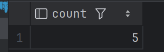
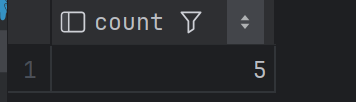
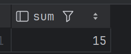
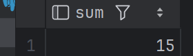
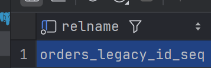
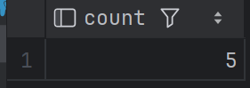
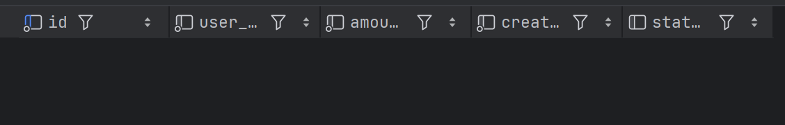
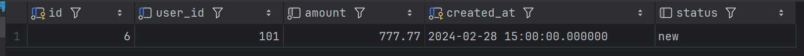

# Часть I. Партиционирование
## 1. Выбор таблицы

```postgresql
CREATE TABLE orders_legacy (
    id SERIAL PRIMARY KEY,
    user_id BIGINT NOT NULL,
    amount DECIMAL(10, 2) NOT NULL,
    created_at TIMESTAMP NOT NULL DEFAULT NOW(),
    status TEXT DEFAULT 'new'
);
INSERT INTO orders_legacy (user_id, amount, created_at) VALUES
(1, 100.50, '2024-01-10 10:00:00'),
(2, 250.00, '2024-01-15 12:30:00'),
(3, 50.00,  '2024-02-01 09:00:00'),
(4, 300.00, '2024-02-20 18:45:00');
```

## 2. Создание партиционированной таблицы

```postgresql
CREATE TABLE orders_partitioned (
    id INT NOT NULL,           
    user_id INT NOT NULL,
    amount DECIMAL(10, 2) NOT NULL,
    created_at TIMESTAMP NOT NULL,
    status TEXT DEFAULT 'new'
) PARTITION BY RANGE (created_at);

CREATE TABLE orders_y2024m01 PARTITION OF orders_partitioned
    FOR VALUES FROM ('2024-01-01') TO ('2024-02-01');

CREATE TABLE orders_y2024m02 PARTITION OF orders_partitioned
    FOR VALUES FROM ('2024-02-01') TO ('2024-03-01');

CREATE UNIQUE INDEX idx_orders_part_id_created_at ON orders_partitioned (id, created_at);
```

## 3. Настройка копирования

```postgresql
CREATE OR REPLACE FUNCTION sync_orders_to_partitioned()
RETURNS TRIGGER AS $$
BEGIN
    INSERT INTO orders_partitioned (id, user_id, amount, created_at, status)
    VALUES (NEW.id, NEW.user_id, NEW.amount, NEW.created_at, NEW.status)
    ON CONFLICT (id, created_at) DO NOTHING;
    
    RETURN NEW;
END;
$$ LANGUAGE plpgsql;
CREATE TRIGGER trg_sync_orders
AFTER INSERT ON orders_legacy
FOR EACH ROW
EXECUTE FUNCTION sync_orders_to_partitioned();

INSERT INTO orders_legacy (user_id, amount, created_at) 
VALUES (99, 555.00, '2024-02-25 10:00:00');

SELECT 'LEGACY' as tbl, * FROM orders_legacy WHERE user_id = 99
UNION ALL
SELECT 'PARTITIONED' as tbl, * FROM orders_partitioned WHERE user_id = 99;
```
## 4. Перенос данных
```postgresql
INSERT INTO orders_partitioned (id, user_id, amount, created_at, status)
SELECT id, user_id, amount, created_at, status
FROM orders_legacy
ON CONFLICT (id, created_at) DO NOTHING;


SELECT count(*) FROM orders_legacy;
SELECT count(*) FROM orders_partitioned;
```


## 5. Восстановление индексов, constraint и тд
```postgresql
CREATE INDEX CONCURRENTLY idx_orders_p_u1 ON orders_y2024m01 (user_id);
CREATE INDEX CONCURRENTLY idx_orders_p_u2 ON orders_y2024m02 (user_id);
CREATE INDEX CONCURRENTLY idx_orders_p_def ON orders_default (user_id);
```

```postgresql
ALTER TABLE orders_partitioned 
ADD CONSTRAINT amount_positive CHECK (amount > 0) NOT VALID;

ALTER TABLE orders_partitioned 
VALIDATE CONSTRAINT amount_positive;
```

```postgresql
ALTER TABLE orders_y2024m01 ADD PRIMARY KEY (id, created_at);
ALTER TABLE orders_y2024m02 ADD PRIMARY KEY (id, created_at);
ALTER TABLE orders_default  ADD PRIMARY KEY (id, created_at);
```

## 6. Проверка идентичности данных

```postgresql
SELECT count(*) FROM orders_legacy;
SELECT count(*) FROM orders_partitioned;

SELECT sum(id) FROM orders_legacy;
SELECT sum(id) FROM orders_partitioned;
```


## 7. Перенос записи на новую таблицу

```postgresql
SELECT seq.relname
FROM pg_class seq
JOIN pg_sequence ps ON seq.oid = ps.seqrelid
JOIN pg_depend d ON d.objid = seq.oid
JOIN pg_class tbl ON d.refobjid = tbl.oid
WHERE tbl.relname = 'orders_legacy';
```

```postgresql
BEGIN;
LOCK TABLE orders_legacy IN ACCESS EXCLUSIVE MODE;
LOCK TABLE orders_partitioned IN ACCESS EXCLUSIVE MODE;

ALTER TABLE orders_partitioned 
ALTER COLUMN id SET DEFAULT nextval('orders_legacy_id_seq');

ALTER SEQUENCE orders_legacy_id_seq OWNED BY orders_partitioned.id;

DROP TRIGGER IF EXISTS trg_sync_orders ON orders_legacy;

ALTER TABLE orders_legacy RENAME TO orders_archive;
ALTER TABLE orders_partitioned RENAME TO orders;

COMMIT;
```

```postgresql
SELECT count(*) FROM orders;
```


## Проверка и удаление старой таблицы

```postgresql
INSERT INTO orders (user_id, amount, created_at) 
VALUES (101, 777.77, '2024-02-28 15:00:00');

SELECT * FROM orders_archive WHERE user_id = 101; 
SELECT * FROM orders_y2024m02 WHERE user_id = 101;
```
```postgresql
DROP TABLE orders_archive;
DROP FUNCTION sync_orders_to_partitioned();
```



# Доп. вопросы

#### 1. Чем полезны партиции и какой в них смысл?
Партиционирование разделяет одну огромную таблицу на несколько физических сегментов меньшего размера.
При наличии условия WHERE по ключу партиционирования, планировщик сканирует не всю таблицу, а только нужную партицию.
Индексы на партиционированных таблицах становятся «легче» и быстрее, так как они строятся для каждой партиции отдельно и чаще помещаются в оперативную память.
#### 2. Что лучше: периодически удалять данные или дропать ненужные партиции? Почему?
Лучше дропать ненужные партиции. Удаление всей партиции происходит мгновенно на уровне файловой системы, в то время как DELETE требует поиска каждой строки.
При удалении через DROP место освобождается сразу. При использовании DELETE строки лишь помечаются как удаленные, что создает нагрузку на VACUUM и приводит к фрагментации данных.
#### 3. Почему в уникальных constraint обязательно должно присутствовать поле партиционирования?
PostgreSQL хранит данные разных партиций в разных физических файлах. Чтобы проверить уникальность значения (например, id), базе пришлось бы сканировать все партиции при каждой вставке. Включение ключа партиционирования в индекс позволяет базе точно знать, в какой именно партиции искать потенциальный дубликат, обеспечивая локальную проверку уникальности.
